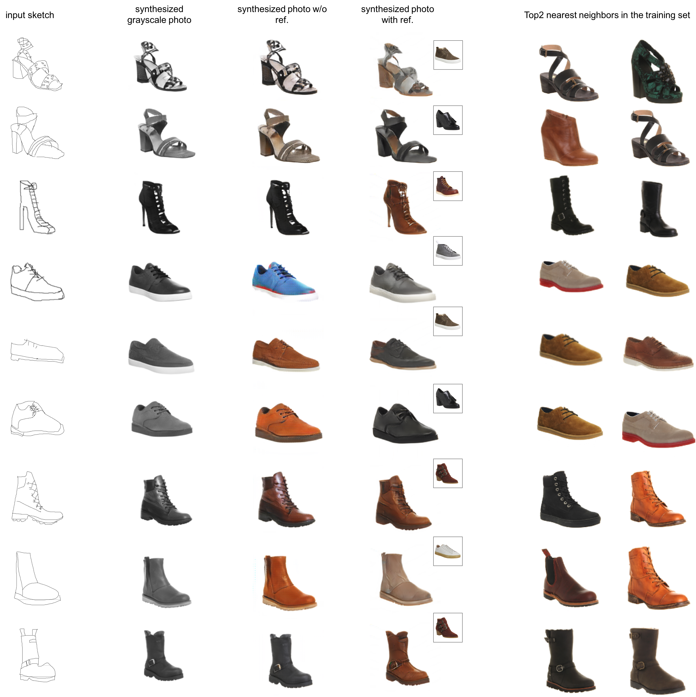
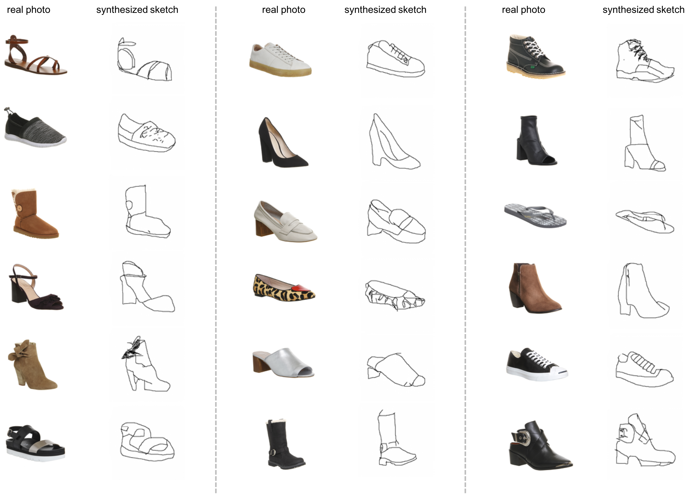
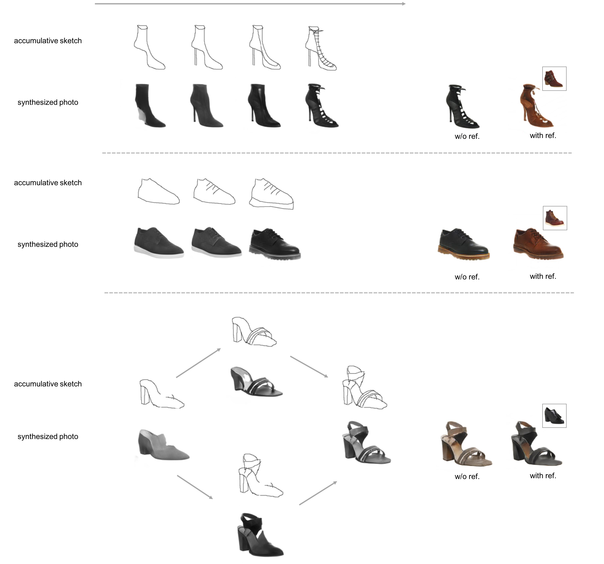

# Unpaired-Sketch-to-Photo-Translation
 **We have released our code at https://github.com/rt219/Unsupervised-Sketch-to-Photo-Synthesis)**

This project is the implementation of *Unsupervised Sketch to Photo Synthesis* (arxiv: [https://arxiv.org/abs/1909.08313](https://arxiv.org/abs/1909.08313)). 
# Photo Generation Examples
This figure shows generated photo images using the proposed model. From left to right: input sketch, generated grayscale photo (shape translation), generated RGB photo (basic colorization), generated RGB photo condition on reference photo (improved colorization), two nearest neighbors of the generated RGB photo. To retrieve the nearest neighbours, we employed an ImageNet pre-trained ResNet18 to extract the deep feature of each image, and computed L2 distance for comparison.

# Sketch Generation Examples
This figure shows generated sketch images using the proposed model.

# Accumulative Results
This figure shows generated grayscale photo images corresponding to accumulative sketches. The last two images of each example are the final outputs. Accumulative sketches are obtained by manipulating images in SVG format.

